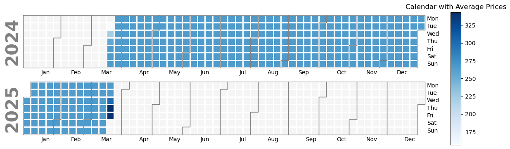
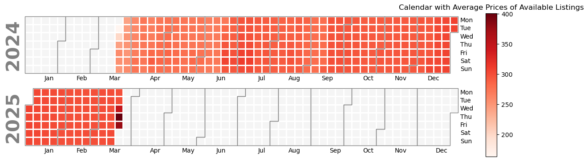

# Revealing London's Airbnb Landscape: A Data Journey
### Author: Errikos Kiladis

## Introduction
London, a city renowned for its rich history, iconic landmarks, and vibrant culture, stands as a beacon for travelers seeking adventure and discovery. At the heart of this bustling metropolis lies a dynamic accommodation ecosystem, shaped by the emergence of Airbnb. With its diverse range of listings, from quaint flats in historic neighborhoods to modern apartments overlooking the Thames, Airbnb has revolutionized the way visitors experience London.

In this immersive journey, we delve into the depths of London's Airbnb market, armed with data as our guide. Our quest is to unravel the mysteries concealed within the numbers, shedding light on the intricate web of factors that influence rental prices, guest satisfaction, and the overall rental landscape. Through careful analysis and exploration, we aim to uncover the stories that animate the city's hospitality scene, offering insights into the trends and dynamics that shape the experiences of hosts and guests alike. Join us as we embark on a data-driven odyssey through the heart of London's rental market.

#### Visual 1: Interactive Map of Properties
Our interactive map allows users to navigate through London's Airbnb properties effortlessly. Each point on the map represents a listing, providing essential information such as property name, price, price per accommodate, review rate, and URL to visit the property's webpage. The points are color-coded based on the price per accommodation, with lighter shades indicating lower prices and darker shades representing higher prices.

[Placeholder for Interactive Map]

#### Visual 2: Choropleth Map of Average Price per Neighborhood
The choropleth map divides London into neighborhoods, with colors representing the average rental price in each area. Westminster and Kensington and Chelsea emerge as the most expensive neighborhoods, with average prices of £257 and £248, respectively. The high prices in these areas may be attributed to their central locations and proximity to popular attractions.

[Placeholder for Choropleth Map of Average Price per Neighborhood]

#### Visual 3: Choropleth Map of Average Price per Accommodation
In this visualization, the color scale represents the average price per accommodation in each neighborhood. Westminster, Camden, and Kensington and Chelsea rank as the most expensive areas, with average prices of £72, £70, and £67, respectively. These neighborhoods likely offer a combination of high-end amenities and convenient locations, driving up prices.

[Placeholder for Choropleth Map of Average Price per Accommodation]

#### Visual 4: Choropleth Map of Review Scores for Location
The review scores for location provide insights into the desirability of different neighborhoods. Richmond upon Thames stands out with an impressive average score of 4.87, indicating its popularity among visitors. Despite its high ratings, Richmond upon Thames maintains relatively moderate prices, with an average price of £163 and an average price per accommodation of £49.

[Placeholder for Choropleth Map of Review Scores for Location]

#### Boxplots: Distribution of Prices per Accommodation and Review Scores by Neighborhood
To further explore the distribution of rental prices and review scores, we present boxplots for each neighborhood. These visualizations offer a comprehensive view of the variability in prices and the satisfaction levels of guests across different areas of London.

[Placeholder for Boxplots: Distribution of Prices per Accommodation and Review Scores by Neighborhood]

In summary, our analysis sheds light on the dynamic nature of London's Airbnb market, revealing insights into pricing trends, neighborhood desirability, and guest satisfaction. Whether you're a traveler seeking the perfect accommodation or a host looking to optimize your listing, understanding these factors is key to navigating London's rental landscape effectively.

## Useful Links

- [Inside Airbnb](https://insideairbnb.com/)

- [Airbnb London](https://www.airbnb.com/london-united-kingdom/stays)

1.
<iframe src="map_with_20000_listings.html" width="800px" height="600px"></iframe>

2.

<iframe src="av_price.html" width="800px" height="600px"></iframe>

3. 

<iframe src="price_per_accom.html" width="800px" height="600px"></iframe>

4.

<iframe src="avg_review_location.html" width="800px" height="600px"></iframe>

London's Airbnb market offers a diverse range of rental options, from budget-friendly accommodations to luxurious escapes. In this section, we delve into the intricacies of rental prices, uncovering seasonal trends and geographical nuances.
