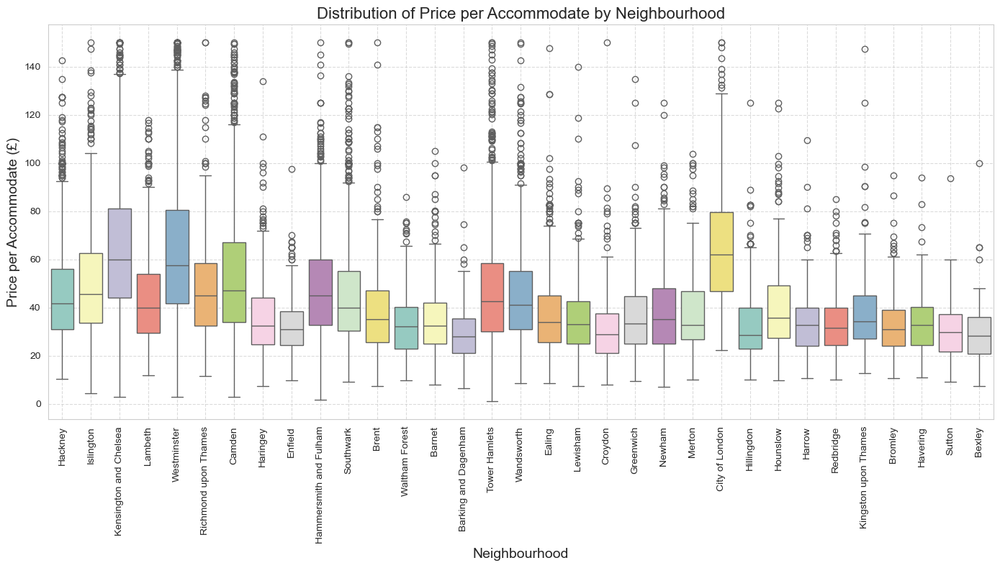
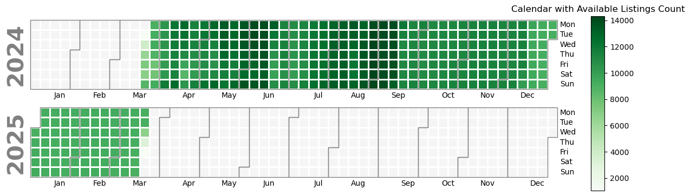

# Revealing London's Airbnb Landscape: A Data Journey
### Author: Errikos Kiladis

## Introduction
Embark on a journey into London's Airbnb market, guided by data. Discover how Airbnb has transformed the city's hospitality scene, offering travelers a diverse range of accommodations. Uncover the factors influencing rental prices, guest satisfaction, and the overall rental landscape, as we delve into the stories behind London's evolving hospitality scene.

#### Exploring London's Airbnb Gems: An Interactive Map
Dive into London's vibrant Airbnb scene with our interactive map of properties. This map offers a convenient way to explore the city's diverse rental options, from cozy studios to luxurious penthouses.

Each point on the map represents a unique Airbnb listing, providing key details like price, review rate, and more. By clicking on a point, you can access additional information and even visit the property's webpage directly.

The map's color-coded system makes it easy to identify affordable options (lighter shades) and premium accommodations (darker shades). This allows you to quickly pinpoint neighborhoods that match your preferences and budget.

Whether you're a budget traveler seeking hidden gems or a luxury seeker looking for upscale stays, our interactive map helps you find the perfect Airbnb for your London adventure. Start exploring now!

<iframe src="map_with_20000_listings.html" width="800px" height="600px"></iframe>

#### Invastigating Prices per Neighborhood

Step into the heart of London's Airbnb landscape with our choropleth map showcasing the average rental prices across different neighborhoods. Each hue on the map corresponds to the average price in a specific area, revealing insights into London's diverse rental market.

**Westminster - £257**

**Kensington and Chelsea - £248**

<iframe src="av_price.html" width="800px" height="600px"></iframe>

These two neighborhoods stand out as the most expensive, reflecting their prime locations for tourists and locals alike. With their proximity to iconic landmarks and vibrant cultural scenes, it's no wonder they command such high prices.

Explore the map to discover more about London's neighborhoods and their rental dynamics. Whether you're seeking luxury accommodations or budget-friendly options, our map provides valuable insights to guide your London adventure.

####  Price from Different Angles
Embark on a journey through London's rental landscape with our interactive choropleth map, showcasing the average price per accommodation in different neighborhoods.

**Westminster - £72**

**Camden - £70**

**Kensington and Chelsea - £67**

<iframe src="price_per_accom.html" width="800px" height="600px"></iframe>

These neighborhoods stand out for their high average prices, suggesting a blend of luxury amenities and prime locations. As hotspots for travelers and locals alike, they offer a unique blend of culture, history, and convenience.

Explore the map to uncover more about London's diverse neighborhoods and their rental dynamics. Whether you're seeking upscale accommodations or budget-friendly options, our map provides valuable insights to guide your London stay.

####  Price in More Dimensions

Now, let's delve deeper into London's rental market by examining the distribution of prices across different neighborhoods. The boxplot visualization provides insights into the variability and spread of rental prices, allowing us to identify areas with both high and low price ranges. Let's explore how prices vary across London's diverse neighborhoods.

#### Richmond upon Thames is London's Hidden Gem
The review scores for location reveal which neighborhoods are favored by visitors. Richmond upon Thames shines with an outstanding average score of 4.87, indicating its popularity among guests. Despite its high ratings, Richmond upon Thames maintains relatively moderate prices, with an average price of £163 and an average price per accommodation of £49.

<iframe src="avg_review_location.html" width="800px" height="600px"></iframe>

In our exploration of London's Airbnb landscape, we have identified a hidden gem: Richmond upon Thames. Despite its relatively moderate prices compared to other neighborhoods, Richmond upon Thames stands out with an impressive average review score for location of 4.87. This high rating suggests that visitors find the neighborhood highly desirable, likely due to its unique charm, scenic beauty, and perhaps its proximity to attractions such as Richmond Park and the River Thames. Thus, while other neighborhoods may command higher prices, Richmond upon Thames offers an exceptional experience that captivates visitors and earns glowing reviews.

#### London's Availability

Take a look at the calendar below to see how many apartments are available for rent in London each day. This plot helps us see when more places are up for grabs and when there are fewer options. By looking at these patterns, we can understand how the rental market in London changes over time and how it might affect prices.

The daily insights from our availability calendar reveal intriguing patterns in London's Airbnb market. Late June to early July appears notably available, suggesting a potential window of opportunity for travelers seeking accommodation during this period. Conversely, late May to mid-June and late August to mid-September appear exceptionally busy, indicating high demand for rental properties during these months.

One possible explanation for these trends could be the seasonal variation in tourism and travel patterns. Late spring and early summer often coincide with peak travel seasons, as visitors flock to London to enjoy the pleasant weather and participate in various cultural events and festivals. Similarly, late August to mid-September may experience heightened demand due to the back-to-school season and last-minute summer vacations.

Property owners and hosts can leverage these insights to optimize their pricing strategies and capitalize on periods of high demand. By adjusting prices and availability based on seasonal fluctuations, hosts can maximize their occupancy rates and revenue potential. Likewise, travelers can use this information to plan their trips strategically, avoiding peak periods when prices are typically higher and availability may be limited.

#### Conclusion

In conclusion, our data-driven journey through London's Airbnb landscape has unveiled a wealth of insights into the city's rental market. From the fluctuation of rental prices across neighborhoods to the desirability of different areas based on review scores, we've gained a deeper understanding of the factors shaping accommodation trends in the city. Through interactive maps, choropleth visualizations, and box plots, we've navigated through the complexities of rental prices, availability, and customer satisfaction, uncovering hidden gems and providing valuable insights for both travelers and property owners alike. As we continue to explore and analyze data, we're empowered to make informed decisions and unlock new opportunities in London's dynamic rental market.

## Useful Links

- [Inside Airbnb](https://insideairbnb.com/)

- [Airbnb London](https://www.airbnb.com/london-united-kingdom/stays)
